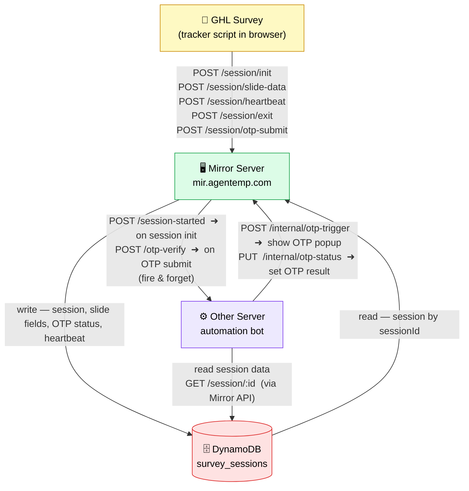

# System Architecture

```mermaid
flowchart TD
    Survey["👤 GHL Survey\n(tracker script in browser)"]
    Mirror["🖥️ Mirror Server\nmir.agentemp.com"]
    DB[("🗄️ DynamoDB\nsurvey_sessions")]
    Other["⚙️ Other Server\nautomation bot"]

    Survey -->|"POST /session/init\nPOST /session/slide-data\nPOST /session/heartbeat\nPOST /session/exit\nPOST /session/otp-submit"| Mirror

    Mirror -->|"write — session, slide fields, OTP status, heartbeat"| DB
    DB -->|"read — session by sessionId"| Mirror

    Mirror -->|"POST /session-started  ➜  on session init\nPOST /otp-verify  ➜  on OTP submit\n(fire & forget)"| Other

    Other -->|"POST /internal/otp-trigger  ➜  show OTP popup\nPUT  /internal/otp-status  ➜  set OTP result"| Mirror

    Other -->|"read session data\nGET /session/:id  (via Mirror API)"| DB

    style Survey fill:#fef9c3,stroke:#ca8a04,color:#000
    style Mirror fill:#dcfce7,stroke:#16a34a,color:#000
    style DB     fill:#fee2e2,stroke:#dc2626,color:#000
    style Other  fill:#ede9fe,stroke:#7c3aed,color:#000
```
