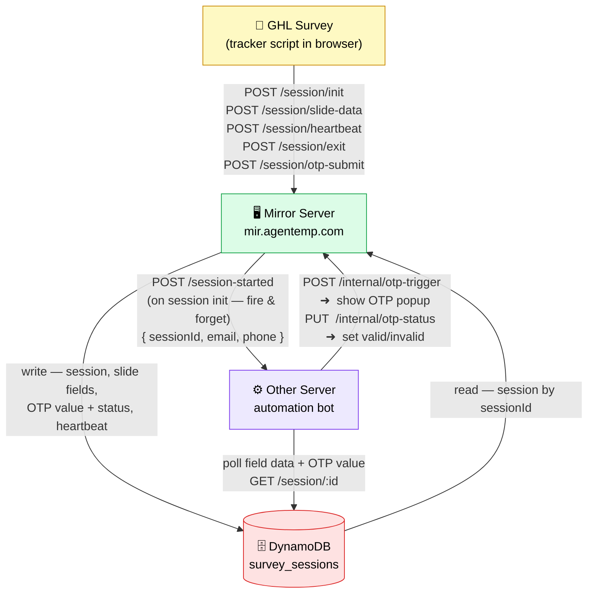
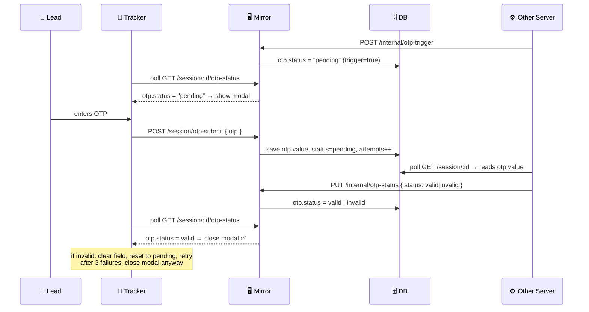

# System Architecture

## OTP Flow (simplified)

## What Other Server needs to implement (just 1 endpoint)

| Endpoint | Called by | When | Payload |
|----------|-----------|------|---------|
| `POST /api/mirror/session/start` | Mirror Server | On session init | `{ sessionId, email, phone }` |

That's it. Everything else goes through our APIs.

## Other Server calls back on our server (2 endpoints)

| Endpoint | When |
|----------|------|
| `POST /internal/otp-trigger` | When they want to show OTP popup to lead |
| `PUT /internal/otp-status` | After validating OTP — sets `valid` or `invalid` |
