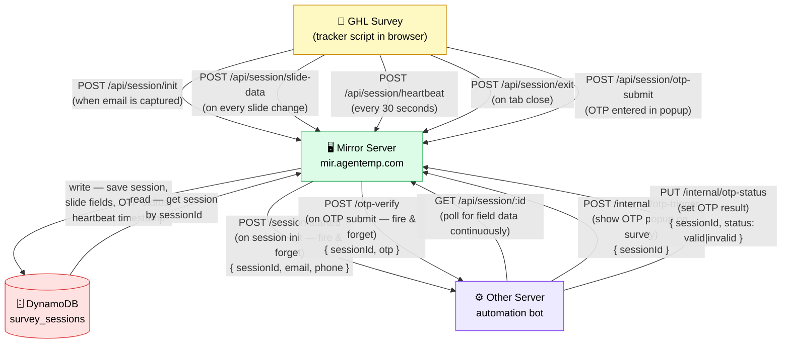

# System Architecture

```mermaid
flowchart TD
    Survey["👤 GHL Survey\n(tracker script in browser)"]
    Mirror["🖥️ Mirror Server\nmir.agentemp.com"]
    DB[("🗄️ DynamoDB\nsurvey_sessions")]
    Other["⚙️ Other Server\nautomation bot"]

    %% ── Survey → Mirror ──────────────────────────────────
    Survey -->|"POST /api/session/init\n(when email is captured)"| Mirror
    Survey -->|"POST /api/session/slide-data\n(on every slide change)"| Mirror
    Survey -->|"POST /api/session/heartbeat\n(every 30 seconds)"| Mirror
    Survey -->|"POST /api/session/exit\n(on tab close)"| Mirror
    Survey -->|"POST /api/session/otp-submit\n(OTP entered in popup)"| Mirror

    %% ── Mirror ↔ DB ──────────────────────────────────────
    Mirror -->|"write — save session,\nslide fields, OTP status,\nheartbeat timestamp"| DB
    DB -->|"read — get session\nby sessionId"| Mirror

    %% ── Mirror → Other Server ────────────────────────────
    Mirror -->|"POST /session-started\n(on session init — fire & forget)\n{ sessionId, email, phone }"| Other
    Mirror -->|"POST /otp-verify\n(on OTP submit — fire & forget)\n{ sessionId, otp }"| Other

    %% ── Other Server → Mirror ────────────────────────────
    Other -->|"GET /api/session/:id\n(poll for field data continuously)"| Mirror
    Other -->|"POST /internal/otp-trigger\n(show OTP popup on survey)\n{ sessionId }"| Mirror
    Other -->|"PUT /internal/otp-status\n(set OTP result)\n{ sessionId, status: valid|invalid }"| Mirror

    %% ── Styles ───────────────────────────────────────────
    style Survey fill:#fef9c3,stroke:#ca8a04,color:#000
    style Mirror fill:#dcfce7,stroke:#16a34a,color:#000
    style DB     fill:#fee2e2,stroke:#dc2626,color:#000
    style Other  fill:#ede9fe,stroke:#7c3aed,color:#000
```

> **Note:** Other Server does **not** talk to DynamoDB directly — it reads all data through `GET /api/session/:id` on the Mirror Server.
