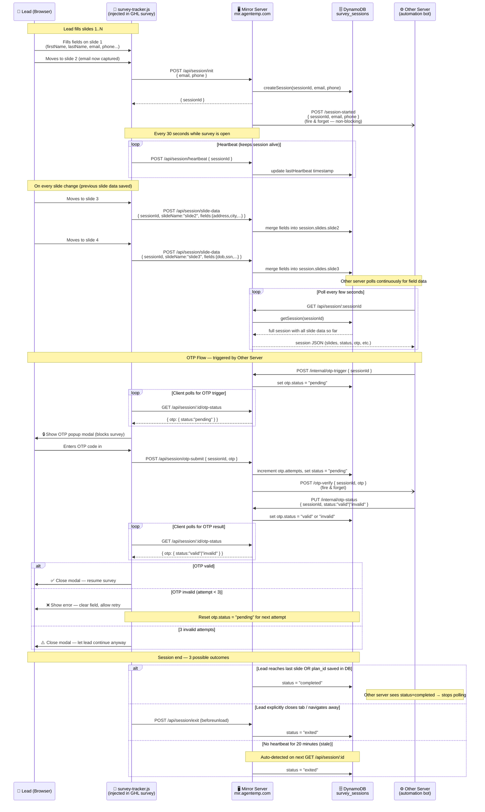

# System Architecture — GHL Survey Mirror



---

## Key Points

| Component | Role |
|-----------|------|
| `survey-tracker.js` | Injected into GHL survey page. Watches slide changes, captures field values, fires all API calls |
| `Mirror Server` | Node/Express on `mir.agentemp.com:9000`. Stores data, coordinates between survey and Other Server |
| `DynamoDB survey_sessions` | Source of truth. Stores session, all slide field data, OTP state, heartbeat timestamp |
| `Other Server` | Automation bot. Polls Mirror Server to read field data and fill a parallel form in real time |

## Session States

```
pre-init  →  active  →  completed
                 ↓
               exited  (explicit or stale 20min)
```

## API Quick Reference

| Method | Endpoint | Called by |
|--------|----------|-----------|
| POST | `/api/session/init` | Tracker (on email capture) |
| POST | `/api/session/slide-data` | Tracker (on slide change) |
| POST | `/api/session/heartbeat` | Tracker (every 30s) |
| POST | `/api/session/exit` | Tracker (tab close) |
| POST | `/api/session/otp-submit` | Tracker (OTP field filled) |
| GET  | `/api/session/:id` | Other Server (polling) |
| GET  | `/api/session/:id/otp-status` | Tracker + Other Server |
| POST | `/internal/otp-trigger` | Other Server → Mirror |
| PUT  | `/internal/otp-status` | Other Server → Mirror |
