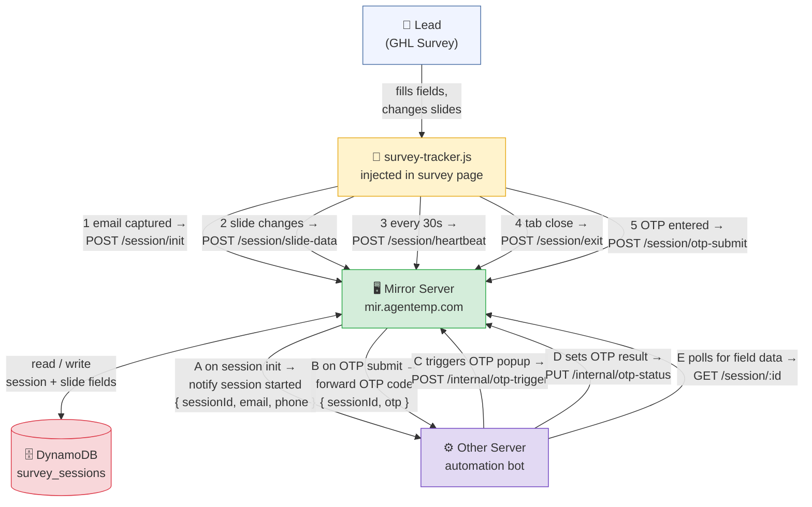

# System Architecture



---

## When each API is called

| # | Who calls | Endpoint | When |
|---|-----------|----------|------|
| 1 | Tracker → Mirror | `POST /session/init` | Lead's email is captured (session created) |
| 2 | Tracker → Mirror | `POST /session/slide-data` | Lead moves to next slide (saves previous slide fields) |
| 3 | Tracker → Mirror | `POST /session/heartbeat` | Every 30 seconds (keeps session alive) |
| 4 | Tracker → Mirror | `POST /session/exit` | Lead closes/leaves the tab |
| 5 | Tracker → Mirror | `POST /session/otp-submit` | Lead types OTP in the popup modal |
| A | Mirror → Other | `notify session started` | Immediately after session init |
| B | Mirror → Other | `forward OTP` | Immediately after OTP submit |
| C | Other → Mirror | `POST /internal/otp-trigger` | When Other Server wants to show OTP popup |
| D | Other → Mirror | `PUT /internal/otp-status` | After Other Server validates OTP |
| E | Other → Mirror | `GET /session/:id` | Continuously polling for latest field data |

## What's stored in DynamoDB per session

```
session {
  sessionId        ← unique UUID
  email            ← lead's email
  phone            ← lead's phone
  status           ← active | exited | completed
  lastHeartbeat    ← timestamp (stale if > 20 min ago)
  slides {
    slide1: { firstName, lastName, email, phone, ... }
    slide2: { address, city, state, zip, ... }
    slide3: { dob, ssn, gender, ... }
    ...
  }
  otp {
    status         ← pending | valid | invalid
    attempts       ← 0–3
  }
}
```
