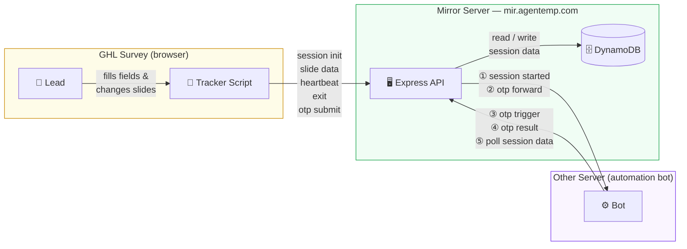

# System Architecture

### How it works

**Survey side**
1. Lead fills the survey — tracker script monitors field changes
2. When email is captured → `session/init` → session created in DB
3. On every slide change → `session/slide-data` → fields saved to DB
4. Every 30s → `session/heartbeat` → keeps session alive
5. On tab close → `session/exit` → marks session exited

**Mirror Server**
- Stores everything in DynamoDB (`survey_sessions` table)
- On session init → calls Other Server *(fire & forget)*
- On OTP submit → forwards OTP to Other Server *(fire & forget)*

**Other Server**
- Polls `GET /session/:id` to read the latest field data in real time
- Calls `POST /internal/otp-trigger` when it wants to show the OTP popup
- Calls `PUT /internal/otp-status` to set OTP result (valid / invalid)

**Session ends when:**
- Lead reaches last slide or plan is saved → `status: completed`
- Lead closes the tab → `status: exited`
- No heartbeat for 20 minutes → auto-marked `exited`
